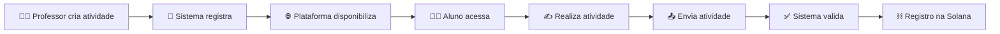

# 📚 Plataforma de Atividades Escolares Flexível

**Autor:** Milena é Fábio 


## 💡 Descrição

🎯 Este projeto tem como objetivo ajudar alunos que não conseguem estar sempre presentes na escola, seja por faltas, trabalho ou responsabilidades familiares.

💻 A plataforma permite que esses alunos acessem, guardem e entreguem atividades escolares de qualquer lugar, no seu próprio tempo, evitando a perda de conteúdo e prazos.


## ⚙️ Funcionamento Técnico (Como funciona)

📊 Fluxo do sistema:




## 👤 Jornada do Usuário

🧭 Passo a passo do aluno:

1. 🌐 Acessa a plataforma
2. 🔐 Conecta sua carteira digital (ex: Phantom)
3. 📋 Visualiza as atividades disponíveis
4. 📌 Escolhe uma atividade
5. ✍️ Realiza a atividade
6. 📤 Envia a atividade
7. ✅ Confirma a transação
8. 📄 Recebe um comprovante de envio


## 🖼️ Wireframe (Esboço de Telas)

🎨 Adicione aqui o link do seu protótipo (Figma, Canva ou imagem)

Exemplo:
👉 [https://figma.com/seu-projeto](https://figma.com/seu-projeto)

💡 Dica: Mostre botões principais como:

* "📤 Enviar atividade"
* "📋 Ver atividades"
* "📄 Histórico"


## 🔗 Diferencial Blockchain (Solana)

⛓️ O uso da blockchain Solana no projeto garante:

* 🔒 **Imutabilidade:** os dados não podem ser alterados
* 👁️ **Transparência:** é possível verificar os envios
* ⚡ **Velocidade e baixo custo:** ideal para uso frequente


## 🎯 Público-Alvo

👨‍🎓 Alunos que não conseguem estar sempre presentes na escola por:

* ❌ faltas
* 💼 trabalho
* 🏠 responsabilidades familiares

---

# 🚀 Benefício

✨ Permite que o aluno:

* 🌍 Acesse atividades de qualquer lugar
* 💾 Guarde suas tarefas
* ⏰ Entregue no seu próprio tempo
* 📚 Não perca conteúdo ou prazos

---

## 📌 Resumo Visual

```
📚 Problema: Falta de presença escolar
        ↓
💻 Solução: Plataforma online
        ↓
👨‍🎓 Ação: Aluno acessa, faz e envia atividades
        ↓
⛓️ Garantia: Registro seguro na blockchain
        ↓
🎯 Resultado: Sem perda de conteúdo ou prazo
```
